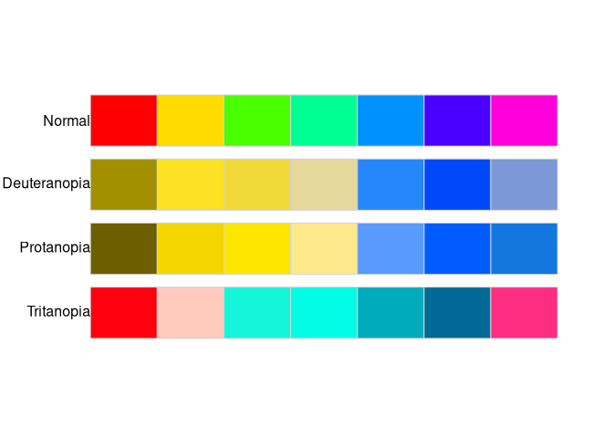

<!-- README.md is generated from README.Rmd. Please edit that file -->

# colorblindcheck

[](https://travis-ci.org/Nowosad/colorblindcheck)
[](https://codecov.io/gh/Nowosad/colorblindcheck?branch=master)

Deciding if a color palette is a colorblind friendly is a hard task.
This cannot be done in an entirely automatic fashion, as the decision
needs to be confirmed by visual judgments. The goal of
**colorblindcheck** is to provide tools to decide if the selected color
palette is colorblind friendly, including:

  - `palette_dist()` - Calculation of the distances between the colors
    in the input palette and between the colors in simulations of the
    color vision deficiencies: deuteranopia, protanopia, and tritanopia.
  - `palette_plot()` - Plotting of the original input palette and
    simulations of color vision deficiencies: deuteranopia, protanopia,
    and tritanopia.
  - `palette_check()` - Creating summary statistics comparing the
    original input palette and simulations of color vision deficiencies:
    deuteranopia, protanopia, and tritanopia.

The work in this package was inspired by a blog post [I wrote some code
that automatically checks visualizations for non-colorblind safe colors.
Here’s how it
works](https://www.vis4.net/blog/2018/02/automate-colorblind-checking/)
by [Gregor Aisch](https://twitter.com/driven_by_data).

## Installation

<!-- You can install the released version of colorblindcheck from [CRAN](https://CRAN.R-project.org) with: -->

<!-- ``` r -->

<!-- install.packages("colorblindcheck") -->

<!-- ``` -->

You can install the development version of **colorblindcheck** from
[GitHub](https://github.com/Nowosad/colorblindcheck) with:

``` r
remotes::install_github("nowosad/colorblindcheck")
```

## Example

The **colorblindcheck** accepts a vector of hexadecimal color
descriptions as the input. It can be created using different existing R
functions (e.g. `rainbow()`) or packages
(e.g. [**colorspace**](https://cran.r-project.org/package=colorspace),
[**RColorBrewer**](https://cran.r-project.org/package=RColorBrewer),
[**rcartocolor**](https://cran.r-project.org/package=rcartocolor),
etc.).

``` r
library(colorblindcheck)
rainbow_pal = rainbow(n = 7)
rainbow_pal
#> [1] "#FF0000" "#FFDB00" "#49FF00" "#00FF92" "#0092FF" "#4900FF" "#FF00DB"
```

The primary function in this package is `palette_check()`, which creates
a summary comparison between the original input palette and simulations
of color vision deficiencies - deuteranopia, protanopia, and tritanopia.

``` r
palette_check(rainbow_pal, plot = TRUE)
```



    #>           name n tolerance ncp ndcp  min_dist mean_dist  max_dist
    #> 1       normal 7  12.13226  21   21 12.132257  61.06471 107.63470
    #> 2 deuteranopia 7  12.13226  21   18  7.725825  50.11732  91.56339
    #> 3   protanopia 7  12.13226  21   19  2.355309  55.41310  88.34820
    #> 4   tritanopia 7  12.13226  21   19  8.216194  51.53678  83.10000

The `palette_check()` function returns a data.frame with 4 observations
and 8 variables:

  - `name`: original input color palette (normal), deuteranopia,
    protanopia, and tritanopia
  - `n`: number of colors
  - `tolerance`: minimal value of the acceptable difference between the
    colors to distinguish between them
  - `ncp`: number of color pairs
  - `ndcp`: number of differentiable color pairs (color pairs with
    distances above the tolerance value)
  - `min_dist`: minimal distance between colors
  - `mean_dist`: average distance between colors
  - `max_dist`: maximal distance between colors

Additionally, a plot comparing the original input palette and
simulations of color vision deficiencies - deuteranopia, protanopia, and
tritanopia can be shown. This help to decide if the selected color
palette is colorblind friendly.

For example, the above output shows that the minimal distance between
colors in the input palette is about 12; however, the minimum distance
between colors simulation of protanopia is only about 2. It can suggest
that some colors in this palette would not be distinguishable by people
with protanopia.

The `palette_dist()` function calculates distances between the colors in
the input palette, as well as in a simulation of the selected color
vision deficiency - deuteranopia, protanopia, and tritanopia. It allows
finding which colors are the most or the least similar and to compare
the behavior of color palettes for different color vision deficiencies.
In the original `rainbow_pal` object, the closest colors were the third
and the fourth one (a distance of about 12); however, the protanopia
version has a minimal distance of 2 between the second and third color.

``` r
# normal
palette_dist(rainbow_pal)
#>      [,1]     [,2]     [,3]     [,4]     [,5]     [,6]      [,7]
#> [1,]   NA 52.96503 85.06611 84.19100 52.61836 51.46782  39.46279
#> [2,]   NA       NA 29.34232 34.74051 65.68745 92.04784  80.83188
#> [3,]   NA       NA       NA 12.13226 69.12782 81.23889 107.63470
#> [4,]   NA       NA       NA       NA 56.87222 74.19228 103.11485
#> [5,]   NA       NA       NA       NA       NA 35.47760  44.20031
#> [6,]   NA       NA       NA       NA       NA       NA  29.94683
#> [7,]   NA       NA       NA       NA       NA       NA        NA
# protanopia
palette_dist(rainbow_pal, cvd = "pro")
#>      [,1]     [,2]      [,3]     [,4]     [,5]     [,6]      [,7]
#> [1,]   NA 73.78789 76.166629 75.13412 58.36222 52.03797 50.317457
#> [2,]   NA       NA  2.355309 12.76751 64.91260 86.33061 84.667281
#> [3,]   NA       NA        NA 12.48830 66.28036 88.34820 86.569277
#> [4,]   NA       NA        NA       NA 56.80334 77.98335 76.869176
#> [5,]   NA       NA        NA       NA       NA 29.43598 28.504135
#> [6,]   NA       NA        NA       NA       NA       NA  3.553296
#> [7,]   NA       NA        NA       NA       NA       NA        NA
```

## References

  - [Datawrapper now checks your colors, so you don’t have
    to](https://blog.datawrapper.de/colorblind-check/)
  - [I wrote some code that automatically checks visualizations for
    non-colorblind safe colors. Here’s how it
    works](https://www.vis4.net/blog/2018/02/automate-colorblind-checking/)
  - [Color Vision Deficiency
    Emulation](http://colorspace.r-forge.r-project.org/articles/color_vision_deficiency.html)
  - [Delta E: The Color
    Difference](http://www.colorwiki.com/wiki/Delta_E:_The_Color_Difference)
